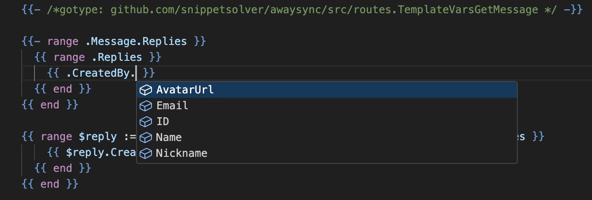

# go-template-transpiler-extension



A vscode extension that provides autocompletion, highlighting, and definition (click through) support to Go templates via transpiling them to a temporary Go file and running `gopls` on that.

Also, mostly because this is a project for my personal use, it also includes syntax highlighting copied from https://github.com/jinliming2/vscode-go-template

## Installation

Search for `go-template-transpiler-extension` or `Go Template Support via Transpiling` on the marketplace and install the last published version there.

## Configuration

1. Associate your Go template extension of choice (if not gtpl) with the `gotmpl_hack` language instead of `gotmpl`. ex:
```json
{
    "files.associations": {
        "*.gtpl": "gotmpl_hack"
    }
}
```
This prevents the standard Go extension from running on top of this one.

2. Add a comment in this format to the top of your template files:
```gotmpl
{{- /* gotype: github.com/owner/repo/path.StructName */ -}}
```

## Installation (for development)

1. Open extension in vscode
2. Open built-in terminal
3. Run `npm install`
4. Run `npm run install-extension`

## Known bugs or unsupported features

- Go to definition doesn't work for dollar sign prefixed variables, ex: `$foo`. You can still click the right hand side of the range definition though.
- Tracking of variable assignments outside of a range tag, ex `{{ $foo := $bar }}`
- Template function support (seems possible though?)

## About

I was getting kind of frustrated with `gopls`'s support of Go templates, and was a bit jealous of GoLand's ability to provide type-aware hints using its `gotype` header/comment.

After an attempt at contributing to `gopls`, I decided that it might be easier to just minimally transpile go templates into Go code then ask vscode (and in turn `gopls`) for autocompletion, highlights, and definitions. Since Go support will probably always be better than Go template support, this seems like a good bet.

The transpiler, if you can call it that, mostly converts ranges into for loops so that variable provenance can be tracked correctly even in deep nesting levels. So a template like this:

```gotmpl
{{- /*gotype: github.com/owner/repo/src/foo.FooWithBars */ -}}

{{ range $bars := .Bars }}
  {{ $bar.BarField }}
{{ end }}
```

is transpiled into:

```go
package main

import . "github.com/owner/repo/src/foo"

for _, dollar_bar := range (FooWithBars{}).Bars {
  dummyVar := dollar_bar.BarField
}
```

Pretty funky idea, lots of regex hell going on here, but close enough for rock and roll.
